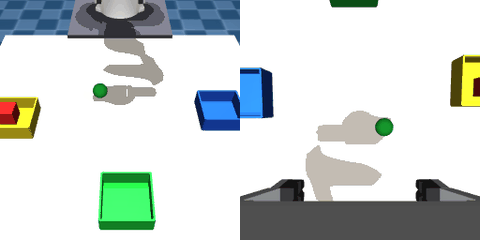
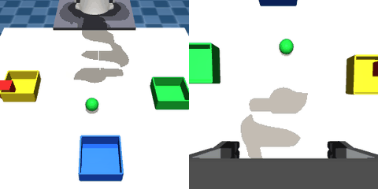
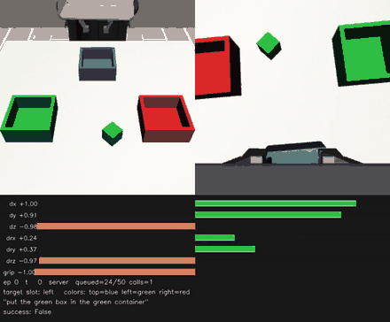
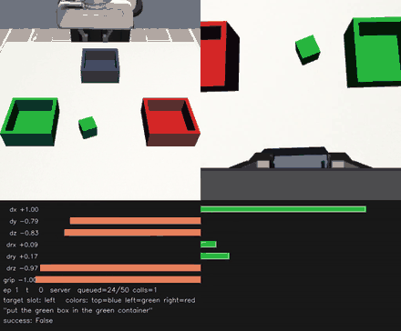

# vla-deployment-loop

**The question: can a pretrained vision-language-action model be adapted to a task outside its
training distribution — and what does it cost to find out?**

Three published checkpoints were taken off the shelf and pushed at one task in a simulator none
of them was pretrained on: MolmoAct2-DROID (trained on video of *real* robots), MolmoAct2-LIBERO
(5.57 B, trained on simulated Pandas) and SmolVLA-450M. Everything around them is the second
half of the question — the full deployment loop, built from scratch: scene, scripted expert,
dataset, training, a GPU policy server, and a scorer strict enough to be believed.

**The answer so far is: not on this budget, and the interesting part is why.** Fine-tuning the
big pretrained models onto this task produced 1/10 and 2/10 — but that is not a ceiling, it is
a receipt. On free Modal credits a LoRA run bought **150 steps, or 0.06 epochs** of the dataset,
and a single checkpoint save ate 4% of the budget. At 0.06 epochs the weights have barely moved;
the risk isn't overfitting, it's that no training happened at all. A real answer to the
adaptation question needs an order of magnitude more compute than a free tier hands out.

What *did* work, on the same hardware, points at where to look next: a **51.6 M model with no
pretraining whatsoever** placed the object 5 times in 6, and the *small* pretrained model hit
36% once it was given 300 demos in a scene rebuilt to match its own pretraining conventions.
So the binding constraints here were compute, data volume, and how far the scene sat from what
the checkpoint already knew — not model capacity. Every one of those is movable, and
[§8](#8-whats-next) lists the experiments that would move them: a properly funded VLM
fine-tune, more demos, a patch-based policy, and reinforcement learning on top of behaviour
cloning to get past what the scripted expert can show.

Two of the early "the model failed" results turned out to be bugs in our own harness that were
scoring a *perfect* policy as zero. That is the other reason to read this as unfinished rather
than settled.

**One robot task. Twelve scored configurations. The one that works is the smallest.**

The task: *pick up the green box and put it in the green container.* The box and the
container move to random spots every episode. A run only counts if the box ends up in the
container — near misses score zero.

> **The target used to be a ball.** For most of this project it was a 40 mm green sphere and
> the instruction said *"green ball"*. It was changed to a 40 mm cube, and the instruction
> changed with it. A sphere has no orientation, so a policy could grab it any way it liked; a
> cube punishes a bad wrist angle. Everything measured before the switch describes the ball,
> and this page says which is which. Ball and box numbers are not comparable.

---

## 1. The pieces

| piece | what it does here |
|---|---|
| **MuJoCo** | the physics simulator, running locally on a laptop |
| **MuJoCo Menagerie** | where the Franka Panda arm model comes from |
| **robosuite** | used in the second, rebuilt version of the task — it ships the LIBERO-style controller and scene conventions the pretrained models expect |
| **LeRobot** | the dataset format the demos are written in, and the trainer for two of the four policies |
| **Modal** | rents the GPU. Both training and serving run there |
| **FastAPI + HTTP** | the wire between the two halves. One `POST /act` endpoint, JSON in, actions out |

Nothing about the model runs locally. The laptop only simulates and draws.

## 2. The loop

```
 ┌──────────── local (this repo) ─────────────┐        ┌──── Modal GPU ─────┐
 │ MuJoCo: Franka Panda + green box + bins    │  HTTP  │ policy server      │
 │  - renders external_cam + wrist_cam        │ ─────► │ POST /act          │
 │  - reads proprioception                    │  JSON  │ in:  2 images,     │
 │  - applies the returned action chunk       │ ◄───── │      state, prompt │
 │  - steps physics, logs every chunk         │        │ out: (N, 8) chunk  │
 └────────────────────────────────────────────┘        └────────────────────┘
```

Each request sends two camera images, the arm's current state, and the instruction string.
The policy replies with a **chunk** — N future actions, not one. The client plays the chunk
out, then asks again. That's one network round trip per chunk instead of per step, which is
the only reason a remote GPU is usable at 20 Hz.

Every policy in this repo speaks that same contract. Same client, same scorer, same wire
format. Only the server changes.

**Why Modal for the right-hand box.** The laptop has no GPU that can hold a 5.57 B checkpoint,
and buying one to answer a question that might take an afternoon is the wrong trade. Modal
rents an L4 or an H100 per second, bills nothing while idle, and takes the same Python image
definition for both training and serving — so the checkpoint a run trains is served from the
identical environment, which removes a whole class of "works in training" bug. It also forces
the split above to be real: the moment the policy lives behind HTTP, the simulator cannot
accidentally reach into it, and swapping policies becomes a redeploy rather than a rewrite.

### The parts that had to be built

Neither box in that diagram came off a shelf. About 10 k lines sit between "download a
checkpoint" and "get a number you can trust", and most of the project's lessons are lodged in
them:

| piece | what it does, and why it exists |
|---|---|
| `libero/libero_closed_loop.py` | the client. Renders both cameras, packs the request, plays the returned chunk out against physics, and streams a JSONL log plus every frame to disk *as the run proceeds*, so a rollout can be watched live and re-scored later |
| `libero/osc_controller.py` | operational-space control, ported from robosuite 1.4.0 to raw MuJoCo. This is what makes our action space the *same* 7-D delta pose the checkpoints were pretrained on rather than a lookalike — and replacing position actuators with it is what took controller sag from 4.84 mm to 0.000 mm |
| `libero/tools/verify_osc.py` | standalone controller checks. No GPU, no Modal, no inference, so it is free to re-run and is meant to be run after every change to the controller or the arm XML |
| `scenes/` + `libero/fine_tune/collect_finetune_data.py` | the scene, the scripted expert, the randomisation and the rejection sampling — every demonstration in the project comes from here |
| `libero/fine_tune/lerobot_v30_writer.py` | a LeRobot **v3.0** writer shaped to match the released MolmoAct2-LIBERO dataset. The obvious writer emits v2.1 with mp4 video features, which is the wrong format twice over for this checkpoint |
| `pin_released_stats.py` / `rebuild_stats.py` | normalisation statistics. Get these wrong and the trainer silently rebuilds the normaliser from our data instead of inheriting the pretrained one — no error, just a policy fine-tuned in the wrong units |
| `smolvla_libero/convert_dataset.py` | re-keys a dataset into SmolVLA's own naming conventions. Feeding a model camera keys it never saw is a silent failure, not a crash |
| `libero/score_runs.py` | the scorer. Reads logs rather than watching rollouts, takes whole directories at once, and grades success as a chain — grasp, then lift, then place, then release — so an impossible total exposes a broken metric |
| `infra/modal_images.py` | every Modal image, defined once. The torch pin used to live in five chains that were meant to share a multi-GB layer and silently stopped the moment one drifted |
| `infra/task_spec.py` | the instruction string, the target's names in the scene, and the data namespace. Each was copy-pasted across five files until it wasn't |
| `libero_modal.py`, `act_modal.py`, `smolvla_modal.py` | three policy servers, one `POST /act` contract. Each reports its own checkpoint on `/health`, which is the only way to know the deploy you just ran actually cut over |
| `greenbox/` | the task rebuilt from scratch — its own env, expert, metrics and Modal app — after the first version had accumulated too many assumptions to trust |
| `scripts/dataset_to_video.py` | renders a collected dataset back to side-by-side mp4. Looking at the data is how two of the worst bugs here were finally caught |

## 3. What's in the repo

| path | what |
|---|---|
| `libero/` | the shared infrastructure — the scene, the controller, the closed-loop client, the demo collector and the scorer that every other track uses |
| `act/` | ACT trained from scratch. The best result |
| `smolvla_libero/` | SmolVLA-450M serving and LoRA training |
| `droid/` | the first attempt. Retired |
| `greenbox/` | the task rebuilt from scratch in robosuite, with cleaner metrics |
| `scenes/` | the MuJoCo scene XMLs. `mujoco_menagerie/` is a pinned submodule and stays pristine |
| `infra/` | Modal images, and the task instruction, each defined exactly once |
| `docs/` | old plans and postmortems, each labelled current or superseded |

Two things live in exactly one file on purpose: every Modal image (`infra/modal_images.py`)
and the instruction string (`infra/task_spec.py`). The instruction used to be copy-pasted into
five files. Training on one wording and serving another doesn't throw an error — it just
quietly asks the policy a question it never studied.

```bash
git clone --recursive <this repo>    # the scenes need the mujoco_menagerie submodule
uv sync
```

Install, run, collect and train commands are in [`docs/SETUP.md`](docs/SETUP.md). Everything
runs from the repo root.

## 4. How the training data was made

There is no human teleoperation here. A **scripted expert** does the task: move above the box,
descend, close, lift, carry, release. It's driven by the same controller the policy will later
drive, which matters more than it sounds.

Each episode randomises the box position and the bin layout. Episodes are **rejection
sampled** — only successful ones are kept. Everything is written out as a LeRobot dataset:
a single parquet file covering all episodes, with the images inlined as PNGs.

The expensive lesson here was that **labels have to come from the controller that consumes
them**. Ours were written as `(target − current) / scale` — tracking error rather than intent —
so a soft-actuated arm baked its own sag into every label as a constant offset. Moving to
operational-space control on torque actuators took that sag from 4.84 mm to **0.000 mm**;
datasets `a1`–`a4` were collected before the fix and discarded. The other correction worth
knowing about — a quaternion unwrapping the long way round, which took the scripted expert from
0/10 to **10/10** — is written up in [`libero/PROGRESS.md`](libero/PROGRESS.md).

The datasets that survived:

| dataset | episodes | ticks/ep | action scale | target |
|---|---|---|---|---|
| `a5` | 30 | 539 | 0.05 | ball |
| `a6` | 30 | 161 | 0.20 | ball |
| `a7` | 60 | ~334 | 0.10 | ball |
| `b1` | 40 | ~410 | 0.05 | **box** |
| `greenbox` | 300 | — | 0.05 | box, rebuilt scene |

## 5. Picking a model, and what each one taught

### 5.1 MolmoAct2-DROID — the training data was the wrong world

The first choice, and the wrong one. **DROID is pretrained on video of real robots** — real
lighting, real cameras, an FR3 arm. Our input is a flat-shaded MuJoCo render of a Panda. That
is two gaps at once: simulated-vs-real, and one arm vs another. It never placed the ball, and
neither did either fine-tune trained on top of it.

There was also a bug underneath, which is the more useful story. **The simulator was ignoring
97% of every command.** The client stepped physics *once* per action; the demos held each
action for **33** steps. Every command got 2 ms of simulated time instead of 66 ms.

It was found by feeding the expert's own perfect actions back through the client's code path.
The ball never moved from where it spawned. A perfect policy scored zero on that harness — so
all three DROID evaluations had been graded against a ceiling of zero. Nine days went into
arguing about which model was worse.

> **Lesson:** run the expert through the inference path before blaming a policy. It is nearly
> free, and it is the only thing that tells "bad policy" apart from "the environment isn't
> listening."

### 5.2 MolmoAct2-LIBERO — right world, but the model is too big to afford

LIBERO is a simulated-Panda benchmark, so a checkpoint pretrained on it starts in roughly our
world. That was the right correction. The problem was size: **5.57 B parameters**, needing a
24 GB GPU just to serve.

The switch forced a line-by-line comparison against the reference environment, which turned up
four errors in a scene that had been rendering plausibly for weeks: the table was 100 mm too
low, the grip point was 9.5 mm off **and rotated 90°**, the reset pose was wrong, and the world
origin had the wrong x. The same exercise produced the most useful measurement in the project
— the stock checkpoint scored **3/3 on a real benchmark task** through the reference
simulator. That settled the argument: the download was fine and the wire format was fine, so
everything failing after that was our scene, our data, or our control.

> **Lesson:** check robot parameters by compiling the model and reading real values, not by
> reading the XML.

But the money ran out long before the training could converge. On a $5 budget, a LoRA run
bought **150 steps = 0.06 epochs** of the dataset, and saving a single checkpoint cost 150 s of
GPU time — about 4% of the whole budget. At 0.06 epochs the model has barely moved off its base
weights; the risk isn't overfitting, it's that no training happened at all. Later, properly
funded fine-tunes on `a5` and `a7` scored 2/10 and 1/10, which is indistinguishable from the
untrained baseline.

> **Lesson:** a large model doesn't just cost more per step, it converts a fixed budget into
> fewer steps. Check what your budget buys in *epochs* before picking the model.

### 5.3 SmolVLA-450M — small enough to actually train, but it needs data

**12× smaller**, serves on the cheapest GPU available. The same $5 becomes a real training run
instead of a rounding error. That's the whole argument for it, and it held up.

The results split cleanly by how much data it got:

- **30–60 demos:** poor. Its first fine-tune did finish the task, but slowly — about 54 action
  chunks — because its demos were slow (539 ticks each). Copying a slow teacher gives you a
  slow student. Later fine-tunes on 60 demos scored 0/13.
- **300 demos, in a scene built to match its pretraining conventions:** **36%**, and the curve
  was still climbing when training stopped.

> **Lesson:** the small model wasn't weak — it was starved. What moved it was more demos, and
> demos that looked like what it was pretrained on.

One clear negative result: a variant that **unfroze the vision encoder** did worse, and
steadily worse. Across 5 checkpoints and 52 rollouts, the best score came from the *earliest*
checkpoint (1/10 at step 488) and every later one scored zero. Unfreezing a pretrained vision
tower and LoRA-ing it on 40 episodes damages features that were already good.

### 5.4 ACT — no pretraining at all

ACT was added to settle a question: was SmolVLA missing the grasp because of *units*, or
because it couldn't *see* well enough? ACT answered it directly by having no frozen vision at
all — a ResNet18 in the gradient path from step 0, **51.6 M** trainable parameters, no
pretraining to preserve.

Trained on the same 60 demos the SmolVLA LoRA failed on, it placed the ball 5 times out of 6
and picked it up **6 out of 6**. So it was seeing, not units. A model that can adapt its
vision learns this task from 60 episodes; a frozen-tower LoRA on the same data does not.

## 6. How it was fine-tuned

| policy | trainable | hardware | steps | notes |
|---|---|---|---|---|
| MolmoAct2-LIBERO | LoRA r32 | L4 24 GB | 150 (later runs longer) | $5 bought 0.06 epochs |
| SmolVLA (`a5`/`a7`) | action expert only | T4 16 GB | 5000 | vision + language frozen |
| SmolVLA (`b1`) | action expert **+ vision** | L4 | 2438 | the unfreeze experiment |
| SmolVLA (rebuilt) | 99.9 M of 450 M (22.2%) | L4 | 12 000 | batch 16, lr 1e-4 cosine, bf16, ~96 min |
| ACT | 51.6 M, all of it | L4 | paused at 30 k of 60 k | batch 16, saves every 10 k |

Two practical notes. ACT's training was **dataloader-bound, not GPU-bound** — the GPU spent
more time waiting for PNG decodes (0.110 s) than computing (0.099 s), and doubling the worker
count only moved the bottleneck onto CPU cores, which are billed separately. And every
training run starts with a **1-step smoke run** that proves build → load → step → save. More
than one step proves nothing extra and costs real money.

## 7. Results

`placed` means the task succeeded. `lift` means the object left the table in the gripper —
worth tracking separately, because for most of these it is as far as they ever got.

| # | policy | data | target | placed | lift |
|---|---|---|---|---|---|
| 1 | ~~MolmoAct2-DROID, stock~~ | — | ball | 0 | 0 |
| 2 | ~~MolmoAct2-DROID, `ae_train`~~ | `a1`–`a4` | ball | 0 | 0 |
| 3 | ~~MolmoAct2-DROID, `lora_train`~~ | `a1`–`a4` | ball | 0 | 0 |
| 4 | MolmoAct2-LIBERO, stock (baseline) | — | ball | 0/3 | 1/3 |
| 5 | MolmoAct2-LIBERO, fine-tuned | `a5` | ball | 2/10 | 3/10 |
| 6 | MolmoAct2-LIBERO, fine-tuned | `a7` | ball | 1/10 | 2/10 |
| 7 | SmolVLA-450M, LoRA | `a5` | ball | completes † | — |
| 8 | SmolVLA-450M, LoRA | `a7` | ball | 0/13 | 2/13 |
| 9 | SmolVLA-450M, LoRA + vision, 5 ck | `b1` | **box** | 1/52 | 2/52 |
| 10 | **ACT, from scratch** | `a7`, 60 eps | ball | **5/6** | **6/6** |
| 11 | ACT, trained 3× longer | `a7` | ball | 6/8 | 8/8 |
| 12 | **SmolVLA-450M, rebuilt task** | 300 demos | box | **36%** | 36% |

Rows 1–3 measured the decimation bug, not a policy. Row 7 (†) finished the task but has no
scored rollouts — only the observation that it worked, slowly. Row 10's 5/6 is the six
evaluation seeds; across all twelve logged rollouts, including six deliberately awkward ball
positions, it is 7/12 placed and 12/12 lifted. Row 12 was run in a different scene with harder
language — three trays whose colours shuffle every episode, so "the green one" cannot be
memorised as a position. It was scored over 25 episodes, with a scripted expert at 100% and
random actions at 0% as the two reference points. It got a grasp in 84% of those episodes but
placed the box in only 36% — the gap between those two numbers is the second finding below.

### What success and failure actually look like

**ACT from scratch** (row 10), external camera on the left, wrist camera on the right. This is
the ball-era scene.

| succeeds — places and withdraws | fails — lifts, carries, never lets go |
|---|---|
|  |  |

The failure on the right is the one that matters: ACT grasps and carries perfectly, parks over
the green bin, and then just holds on. Nothing about the reach is wrong. At this checkpoint the
release was a clean function of a single number — `dx`, the sideways gap between the green bin
and the ball. Every run with `dx ≤ −0.048` held on and every run above it let go, with no
exceptions, so a carry that pulled the arm inward simply never released.

**SmolVLA on 300 demos** (row 12), the rebuilt scene. Agent view, wrist view, and a HUD showing
the seven action channels, the target slot, and the success flag. Tray colours are shuffled
every episode, so the green one has to be read off the image.

| succeeds — 36% of episodes | fails — reaches, grasps, loses it |
|---|---|
|  |  |

Watch the `grip` bar on the failure. The policy gets to the box and closes, but the wrist is
rotated wrong at the moment it closes, so the box squirts out and it spends the rest of the
episode retrying. That is 16 of 25 episodes — not lost, not confused about which tray is green,
just re-attempting a grasp it keeps getting slightly wrong.

Four findings:

**The gripper was a channel nobody taught.** Across 20 MolmoAct2 rollouts, every lift and every
placement came from a run where the gripper closed *at all* — and it closed in half of them,
almost uncorrelated with being near the ball: one closed 0.7 mm away but 58 chunks late, another
did a full close-carry-release on an empty hand 39 mm out. Rejection sampling is why. The expert
only ever closes on a centred, stationary ball, so the states the policy is actually in when it
has to decide are absent from training **by construction**.

**The bottleneck was the wrist, not the language.** Colour grounding was never the problem — the
rebuilt policy put the box in a wrong-coloured tray **0 times out of 25** — but it grasped 84%
of the time and lifted 36%. At the moment it closes, the gripper is 0.045 m from the box (close
enough) and **0.394 rad off in wrist angle**, against 0.048 rad it had already hit earlier in
the same episode. Right place, right angle, then it rotates away before closing. A sphere would
have forgiven that; a cube doesn't.

**The last checkpoint is not the best one.** Three times, across two architectures: ACT's clean
release rule at 10 k went ragged by 30 k even as its motion smoothed and its grasps tightened,
SmolVLA's 3 k beat its 5 k, and the unfreeze sweep peaked at its first checkpoint. **Score
intermediate checkpoints.**

**A metric should be able to catch itself.** The scorer grades success as a chain — grasp, lift,
place, release — each stage requiring the one before it. That is what surfaced `placed 32%`
against `released 8%`: impossible, since letting go precedes placing. `released` was keyed to
the *first* loss of contact, which flickers during transport; keyed to the last let-go, the
numbers reconciled.

## 8. What's next

**Move the simulation to Isaac Sim.** The very first result in this project was a model failing
because a flat-shaded MuJoCo render looks nothing like the real-robot video it was pretrained on
(§5.1). Everything since has worked *around* that gap — picking checkpoints pretrained in
simulation, rebuilding the scene to match their conventions. Isaac Sim attacks it directly:
ray-traced rendering, real materials and lighting, physically-based cameras. The experiment is
to put the same policies on top of a photorealistic version of this task and see how much of
the appearance gap was doing the damage — and whether a checkpoint trained on real robots
becomes usable once the pixels stop giving the simulator away.

**Fine-tune the VLM properly.** The unfreeze experiment failed, but it failed on 40 episodes.
The question of whether the vision-language stack can be adapted rather than damaged is still
open, and 300+ demos is the setting to ask it in.

**A small patch-based policy for lightweight tasks.** Most of what this task needs is local:
where the box is relative to the gripper. A policy operating on image patches instead of a
full vision-language stack should be far cheaper for that class of problem.

**ACT inside a mixture of experts, for many tasks.** ACT's output is a densely encoded action
chunk — a lot of behaviour packed into a small model. That makes it a good candidate as one
expert among several, routed per task, instead of retraining a whole model per skill.

**An RL environment on top of SmolVLA.** Behaviour cloning can only copy the demonstrations,
which is why the slow expert produced a slow policy and why the untrained states around a
failed grasp were never learned. Fine-tuning with reinforcement learning in the same simulator
would let it improve past what the expert showed it.

## Reading further

The detail behind every number on this page:

1. [`docs/SETUP.md`](docs/SETUP.md) — install, run, collect, train
2. [`PROGRESS.md`](PROGRESS.md) — the cross-track story, one section per track
3. The track you care about: [`act/`](act/README.md), [`libero/`](libero/README.md),
   [`smolvla_libero/`](smolvla_libero/README.md), [`greenbox/`](greenbox/README.md),
   [`droid/`](droid/README.md)
4. That track's `PROGRESS.md` — the chronological attempt log, **wrong turns kept in**
5. [`docs/README.md`](docs/README.md) — old plans and postmortems, each labelled current or
   superseded

**When two documents disagree, newest wins**, in this order: `libero/PROGRESS.md` and
`act/PROGRESS.md` (the measurements) → the subproject `README.md` → this file → `docs/`.
Numbers written before the decimation fix and the controller port are evidence of what was
believed at the time, not current fact. Re-measure anything load-bearing.

A note on the progress logs: they keep the wrong turns in on purpose. Corrections are appended
as new sections rather than edited into old ones, because knowing *which* conclusions were
reversed is most of the value.

## License

MIT — see [LICENSE](LICENSE).
